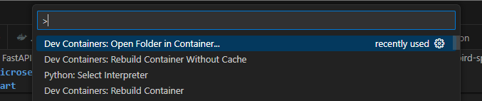
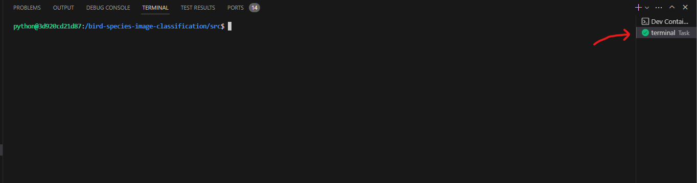
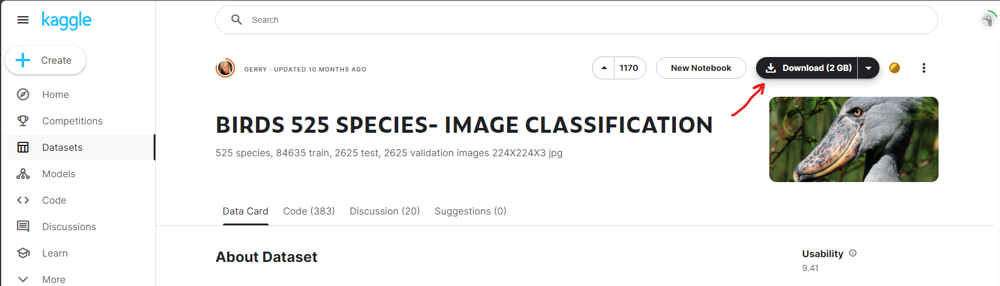
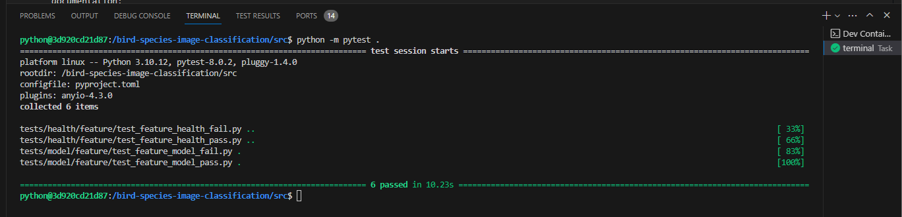
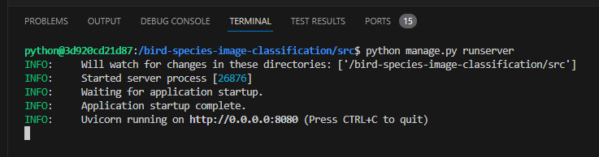
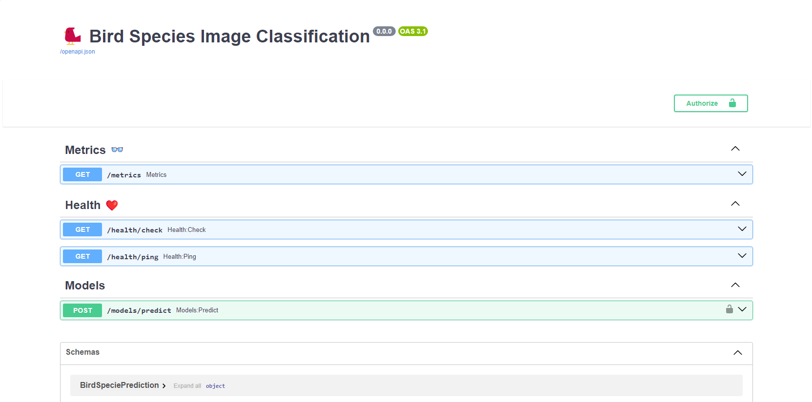
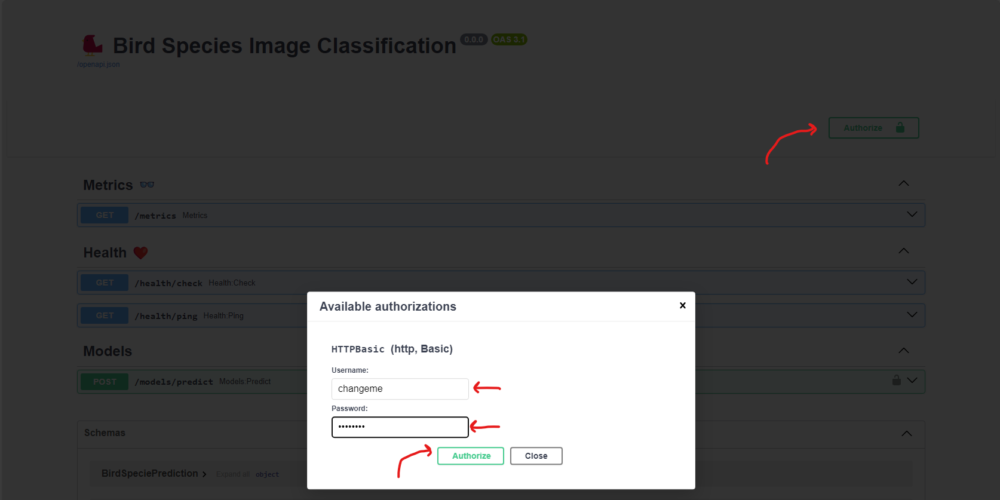
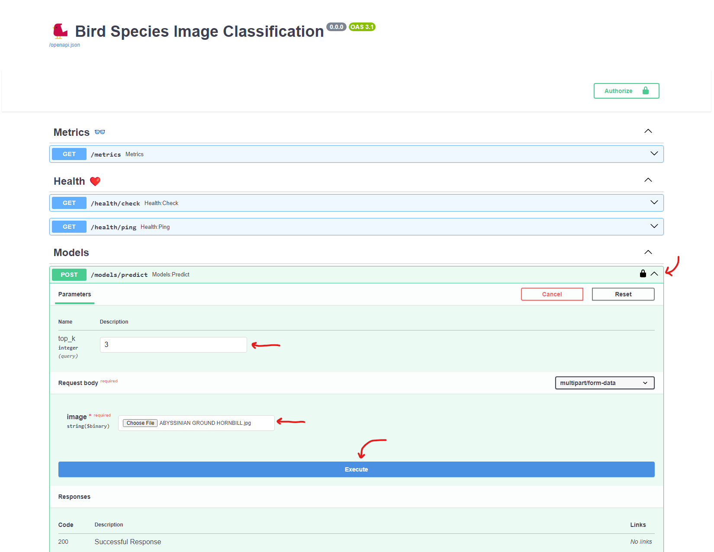

# 🐦 FastAPI Microservice for Bird Species Classification

<p align="center">
    
    
    
    
</p>

This project provides an example of a [FastAPI](https://fastapi.tiangolo.com/) microservice which hosts a bird species classification model trained on Kaggle's [Birds 525 Species - Image CLassification](https://www.kaggle.com/datasets/gpiosenka/100-bird-species/data) dataset.

This project utilizes [pytorch](https://github.com/pytorch/pytorch) to train and run the model. This project also provides:

- A [VS Code development container configuration](https://code.visualstudio.com/docs/devcontainers/containers) which is the recommended method for developing this project.
- Nearly complete type annotations
- Pydantic for type validation and JSON serialization

This project is inspired by the following repositories:

- [fastapi-realworld-example-app](https://github.com/nsidnev/fastapi-realworld-example-app/tree/master)
- [[DeIT][10 Epochs, ~100%acc] Know📚,Train⚙️,Infer🧐](https://www.kaggle.com/code/suraj520/deit-10-epochs-100-acc-know-train-infer)

## Prerequisites

This project assumes common knowledge and understanding of:

- VS Code and the [Remote Development Extension Pack](https://marketplace.visualstudio.com/items?itemName=ms-vscode-remote.vscode-remote-extensionpack) for VS Code
- REST APIs
- PyTorch
- Git
- Basic authentication
- This could be a long list... :)

This project is configured to utilize NVIDIA's [`nvidia/cuda` Docker image](https://hub.docker.com/r/nvidia/cuda), which will enable use of NVIDIA GPUs for this project. This project does not require an NVIDIA GPU, but it is configured to take advantage of an NVIDIA GPU if available.

## Quick Start

The following instructions provide a quick start for developing `fastapi-microservice-bird-species-classification` on _Linux_ or _WSL_.

### 1. Clone repository

```bash
git clone https://github.com/joshjhans/fastapi-microservice-bird-species-classification.git
```

### 2. Attach VS Code to cloned `fastapi-microservice-bird-species-classification` directory

Open the `fastapi-microservice-bird-species-classification` directory with VS Code.

### 3. Open `fastapi-microservice-bird-species-classification` directory in a container



Note that the `Dockerfile` will install the necessary Python dependencies as part of the Docker image.

### 4. Open pre-configured terminal



Press <kbd>Ctrl</kbd> + <kbd>Shift</kbd> + <kbd>B</kbd> to open a pre-configured terminal in the `/bird-species-image-class-fication/src` directory.

### 5. Download 'Birds 525 Species - Image Classification' dataset from [Huggingface](https://www.kaggle.com/datasets/gpiosenka/100-bird-species/data)


Visit [Kaggle Birds 525 Species - Image Classification](https://www.kaggle.com/datasets/gpiosenka/100-bird-species/data) and download the dataset into the `./services/model/data` directory; the directory is expected to be as follows:

```
.src/services/model/data
|-- EfficientNetB0-525-(224\ X\ 224)-\ 98.97.h5
|-- EfficientNetB0-525-(224\ X\ 224)-\ 98.97.h5:Zone.Identifier
|-- birds.csv
|-- birds.csv:Zone.Identifier
|-- test
|-- train
`-- valid
```

### 6. Train the model

Execute the following command in the `./src` directory to train the model:

```bash
python manage.py train-model
```

### 7. Set environment variables

The `./src/.env` file needs to be populated as follows:

```
APP_ENV=devl
USERNAME=changeme
PASSWORD=changeme
```

These variables are used as follows:

- `APP_ENV`: specifies the app environment; valid values include `devl`, `test`, `stage`, and `test` which correspond to the corresponding settings classes in `./src/settings/environments`
- `USERNAME`: the basic authentication username used to secure the `/models/predict` endpoint
- `PASSWORD`: the basic authentication password used to secure the `/models/predict` endpoint

### 8. Test API

Execute the following command in the `./src` directory to test the FastAPI API:

```bash
python -m pytest .
```



### 9. Run the FastAPI service with `uvicorn`

Execute the following command in the `./src` directory to run the FastAPI server with `uvicorn`:

```bash
python manage.py runserver
```



Once the FastAPI server is running, navigate to [http://localhost:8080/api/docs](http://localhost:8080/api/docs) to view the API's Swagger documentation:



### 10. Upload an image of one of the 525 bird species

The `/models/predict` endpoint may be used for testing the bird classification model via the REST API.

First, use the Swagger docs to authorize your request to `/models/predict`; the username and password are the `USERNAME` and `PASSWORD` specified in step `7. Set environment variables` in `./src/.env`.



Once authorized, utilize an image from the [Birds 525 Species - Image CLassification](https://www.kaggle.com/datasets/gpiosenka/100-bird-species/data) dataset's _test_ images to retrieve the list of most matching bird species based on the provided image:



After executing the request, the model will use the provided image to provide a response similar to the following:

```json
{
  "specie": {
    "specie_name": "ABYSSINIAN GROUND HORNBILL",
    "score": 0.35859358310699463
  },
  "top_k": [
    {
      "specie_name": "ABYSSINIAN GROUND HORNBILL",
      "score": 0.35859358310699463
    },
    {
      "specie_name": "KING VULTURE",
      "score": 0.09123741090297699
    },
    {
      "specie_name": "BLACK VULTURE",
      "score": 0.09055078029632568
    }
  ]
}
```

Where `specie` is the _most_ likely match and `top_k` is an array of the highest `top_k` matches.

### 11. Useful Commands

#### Formatting

```bash
ruff check --fix .
ruff format .
```

### 11. To Do

- [ ] Improve model accuracy
- [ ] Improve typing support with implemented `pytorch` logic
- [ ] Match JSON responses to [JSON API Specification](https://jsonapi.org/)
- [ ] Expand test coverage and add unit tests
- [ ] Change how model is loaded and unloaded to improve performance and resource consumption
- [ ] Resolve `pytest` warnings from `httpx` and `pytorch`; update `pyproject.toml` `[tool.pytest.ini_options]`
